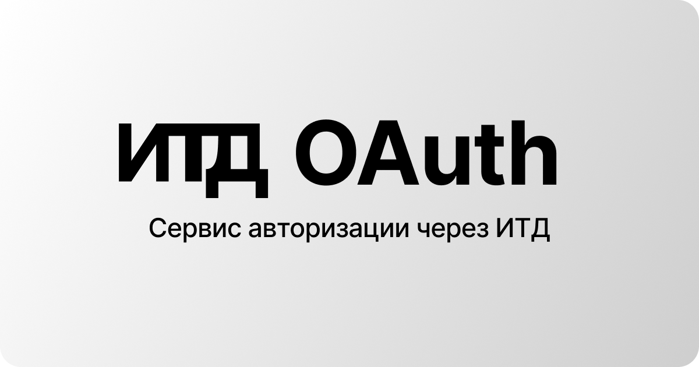

# ITD OAuth SDK

[](https://www.npmjs.com/package/itd-oauth)
[](https://www.npmjs.com/package/itd-oauth)
[](https://opensource.org/licenses/MIT)

Официальный SDK для авторизации через ИТД OAuth.

## Установка

```bash
npm install itd-oauth
# или
bun add itd-oauth
```

Устанавливается в оба проекта — фронтенд и бэкенд. Импортируй нужную часть:

```ts
import { ITDOAuth } from "itd-oauth";          // бэкенд
import { ITDOAuthClient } from "itd-oauth/client"; // фронтенд
```

## Документация

- [Quickstart](./docs/QUICKSTART.md) — первый рабочий вход за 5 минут
- [Серверный SDK](./docs/SERVER.md) — `ITDOAuth`: `exchangeCode`, `proxy`, `refreshToken`
- [Браузерный SDK](./docs/CLIENT.md) — `ITDOAuthClient`: `loginWithPopup`
- [Scope](./docs/SCOPES.md) — список прав и что они дают
- [Ошибки](./docs/ERRORS.md) — коды ошибок и как их обрабатывать
